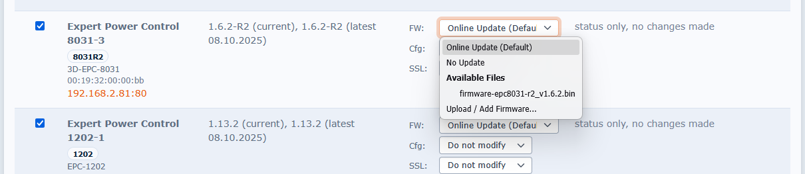
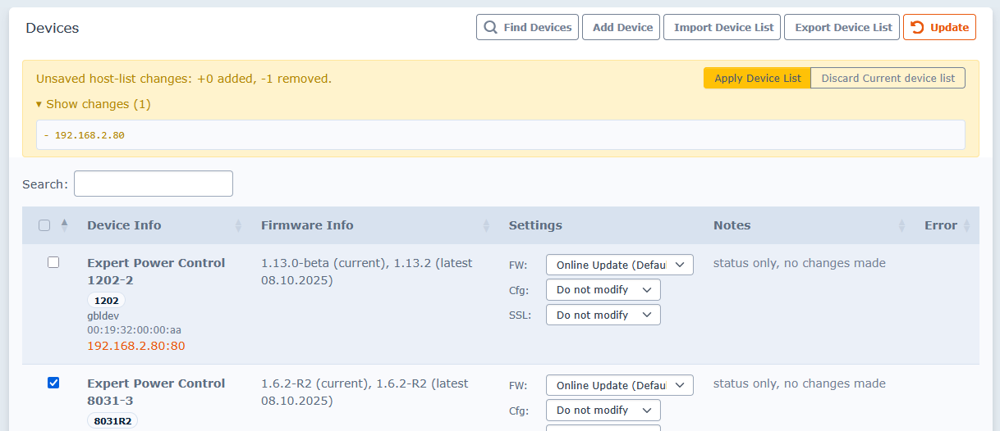
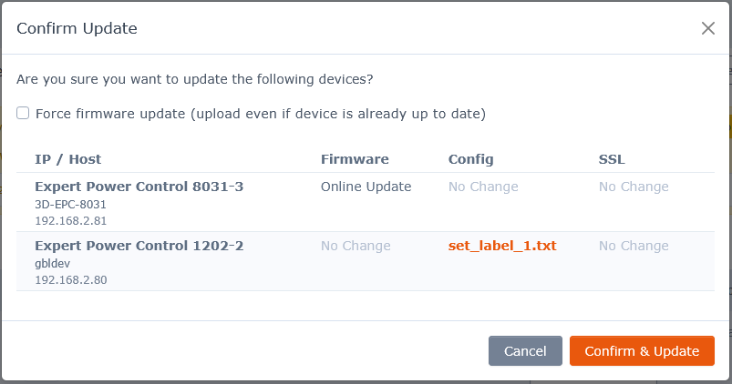

# upload.py
`upload.py` is a Script-Tool that aims to automatically deploy firmware updates, 
configuration and/or ssl certificates to multiple **Gude Systems GmbH PDU devices**

Firmware updates can be obtained automatically (by using `--onlineupdate`) or manually.

Device configuration and ssl certificates, can be prepared beforehand.

## Requirements

1. A `Python` capable device (e.g. PC).
   1. Minimum required: `Python Version 3.7`
   2. This Script is using `requests` python module
2. A **Gude Systems GmbH PDU device**

## Usage

There are two options to set individual commands either via **Command Line Parameters** or via `upload.ini`-config file.

## Web UI (GUI)

Running `upload.py` without CLI arguments starts the local Web UI (`http://127.0.0.1:8000`) and opens it in your browser:

```shell
python .\upload.py
```

### Quick Start (GUI)

1. Click **Find Devices** to discover devices (GBL/UDP).
2. Adjust row settings for **FW / Cfg / SSL** as needed.
3. Click **Update** and review actions in the confirmation dialog.
4. Confirm update execution.

### Current Device List vs Stored Device List

The GUI now uses a two-stage list workflow:

- **Current device list**: in-memory working list used for selection/editing in the UI.
- **Stored device list (`upload.ini`)**: persisted host list on disk.

Important behavior:

- Add/import/remove actions change the **current device list** first.
- Unsaved list changes are shown in a banner.
- **Apply Device List** writes current list changes to `upload.ini`.
- **Discard Current device list** restores hosts from `upload.ini`.

### Import/Export Device List (GUI)

Import flow:

- `Import Device List` shows a preview modal.
- You can choose:
  - **Merge into current device list selection**
  - **Replace current device list selection**

Export flow:

- `Export Device List` offers:
  - **Current selection (N)**
  - **All items in list (N)**
  - **All saved items in upload.ini (N)**

### Firmware/Config/SSL Update Behavior (GUI)

- **Force firmware update** is optional and controlled by a checkbox in the update confirmation modal.
  - Default: **unchecked**.
- **No Update** now truly skips firmware upload for the selected device.
- Even when firmware is skipped, config and/or SSL updates can still run.
- Status/notes now include those actions, for example:
  - `Skipped (No Update); Config updated (config.txt)`
  - `Skipped (No Update); SSL certificate updated (cert.pem)`

### GUI Startup Notes

If `upload.ini` is missing or contains no hosts and GBL is disabled, the GUI starts with an empty list.  
Use **Find Devices** in GUI or provide hosts / `gbl=search` in `upload.ini`.

### Embedded Screenshots

Firmware selection:



Current device list changes:



Update confirmation dialog:



## Dev Release Pipeline (GitHub Actions)

The repository includes a manual **dev release** workflow in `.github/workflows/dev-release.yml`.

Trigger:

- Manual run via **workflow_dispatch**.

What it does:

1. Calculates the next tag from existing `vX.Y.Z-dev` tags (patch bump).
2. Updates versions automatically:
   - `pyproject.toml` -> `X.Y.Z.dev0`
   - `webui/index.html` sidebar -> `X.Y.Z-dev`
3. Commits the version bump back to `dev`.
4. Creates and pushes a new tag `vX.Y.Z-dev`.
5. Builds Windows single-file executable with PyInstaller (`upload.spec`).
6. Publishes a GitHub **pre-release** with the built `.exe` asset.

Result:

- Dev pre-releases are created only when manually triggered from GitHub Actions.

## License and Brand Assets

- Source code in this repository is licensed under the terms in `LICENSE`.
- GUDE logos and brand assets are excluded from that license.
- See `TRADEMARKS.md` for the explicit trademark/logo restrictions and file list.

### Preparation

#### Essential

- Device selection
  - automatically detect device(s) to update
    - enable `gbl=search` in `upload.ini` to run a 'search' broadcast in your local network(s)
  - manually select device(s) to update
    - enable e.g. `net1 = 192.168.1.0/24`
      - to probe a subnet
    - enable e.g. `ip1 = 192.168.1.11`
      - to probe a single device unit (or multiple units with `ip2`, `ip3`, etc...)
    - use `--iprange 192.168.1.11` or `--iprange host/DNS` 
      - to probe a single device unit
    - use `--iprange 192.168.1.11 192.168.1.12` 
      - to probe multiple device unit
  - any combination of parameters mentioned above can be combined
- Online update
  - use `--onlineupdate` to use the most recent internet firmware files
  (firmware binary files are automatically downloaded to `fw/*.bin`)

#### Optional

- Get custom firmware version and save it under `fw/`
  - to run offline updates
    - download firmware binary files to `fw/*.bin`
    - set target version in `fw/version.ini`
  - to get online files and run offline updates later
    - run `fw/onlineupdate.py`
    - this will download all binary files to `fw/*.bin`, and sets `fw/version.ini` accordingly

- Prepare custom configuration and save it under `config/`
  - you can download / edit / down-strip / extend a device's live configuration by downloading `config.txt` at each device's maintenance page
  - you can use CLI commands to create your desired config file
    - a complete list of all CLI commands can be found in every device's PDF manual
  - if file exists, `config/config_[MAC_ADD].txt` is deployed to this device
    - e.g. `config/config_00_19_32_00_00_01.txt`
  - of otherwise, and if file exists, `config/config_[IP].txt` is deployed to this device
    - e.g. `config/config_192_168_1_10.txt`
  - of otherwise, and if file exists, `config/config.txt` is deployed to each device
- Prepare custom ssl certificate and save it under `ssl/`
  - upload.py looks out for files `ssl/cert_[MAC_ADD].pem`, `ssl/cert_[IP].pem` or `cert.pem`, 
  as described above with configuration files
    - e.g. `ssl/cert_00_19_32_00_00_01.pem` or `ssl/cert_192_168_1_10.pem` 
- when the firmware is already up to date or updated, `upload.py` can also deploy device configuration 
  and/or ssl certificates per device 

## Command Line Parameters

| Param            | Default       | Usage
|------------------|---------------|------------------
| `--forcefw`      |               | upload and extract firmware file, even if device is already up-to-date 
| `--upload_ini`   | `upload.ini`  | use alternative filename instead of upload.ini
| `--version_ini`  | `version.ini` | use alternative filename instead of fw/version.ini
| `--onlineupdate` |               | use online version info and download binary files
| `--iprange`      |               | add host / net to upload.ini's [host] section
| `--configip`     |               | if deploying a single device config, IP might change to this IP by config import
| `-S`, `--status_only` |          | only fetch device status without making any changes
| `-G`, `--gbl` |          | use GUDEBootLoader Search to find devices
| `-sf`, `--search_folder` |        | recursively search specified folder for compatible firmware binary files
| `-r`, `--repl_prod_id` | `{'2110': '2111'}` | replace product IDs to avoid naming conflicts in firmware updates
| `-d`, `--devices`|               | overwrite upload.ini settings with JSON formatted device configuration
| `-H`, `--header` |               | set custom HTTP headers as JSON formatted string

Tip: run `python .\upload.py --help` for practical command examples shown directly in the CLI help output.

## Advanced Usage

### Device Configuration Without upload.ini

With the new `-d` or `--devices` parameter, you can specify device configuration directly in JSON format without needing an upload.ini file:

```shell
python upload.py --devices "{\"httpDefaults\":{\"username\":\"admin\",\"password\":\"admin\"}}"
```

To completely avoid using upload.ini, specify a non-existent file with `--upload_ini`.

### Firmware Search and Selection

The script now offers more options for finding and selecting firmware:

- Use `-s` or `--search_folder` to recursively search a specified folder for compatible binary files. The script will find files following the same naming convention as web downloads and automatically create a version.ini style configuration.

- The `-r` or `--repl_prod_id` parameter allows replacing product IDs to handle naming conflicts when finding suitable firmware updates. This is a specialized option and shouldn't normally need modification.

- Enhanced `--onlineupdate` now fetches the complete version.ini file from the web, making the `-v` parameter and local version.ini file optional in this mode.

- Wildcard product IDs (for example `80xxR2`) are resolved deterministically:
  - The resolver first prefers the concrete model variant parsed from the device product name (for example `8031-3` -> `8031R2`).
  - If no concrete variant can be derived, candidates are processed in stable order to avoid run-to-run randomness.

- Offline compatibility fallback for shared binaries:
  - In offline mode, if the resolved section's firmware file is missing locally, the resolver tries compatible sections in the same family/revision (for example `80xxR2`) and uses the first section that has an existing local firmware file.
  - This allows updates to proceed when models share one binary but only one variant file is available locally.

### Device Processing Summary

Upon completion, the script now provides a "Device Processing Summary" that gives clear feedback on the status of each device update operation.

## HTTPS / Authentication

- `upload.py` is using HTTP to upload config and firmware
- using HTTPS and user Authetification can be enabled in `upload.ini` 
- either tweak `[httpDefaults]` or the appropriate device section like e.g. `[192.168.1.11]`
  - `ssl=1` enabled HTTPS
  - giving username / password sets up HTTP Basic Authentication

## Example

- Selected device(s): `10.113.6.66`, given by `--iprange`
- Selected firmware: most recent, given by `--onlineupdate`
- Selected config: cli given by file `config\config_00_19_32_00_e8_b6.txt`

```shell
python .\upload.py --iprange 10.113.6.66 --onlineupdate
2022-10-11 11:44:18,400 __main__           INFO     trying 10.113.6.66...
2022-10-11 11:44:18,402 gude.deployDev     INFO     Searching .txt file, trying:
2022-10-11 11:44:18,402 gude.deployDev     INFO     - config\config_00_19_32_00_e8_b6.txt
2022-10-11 11:44:18,402 gude.deployDev     INFO     Found: config\config_00_19_32_00_e8_b6.txt
2022-10-11 11:44:18,402 gude.deployDev     INFO     Searching .pem file, trying:
2022-10-11 11:44:18,403 gude.deployDev     INFO     - ssl\cert_00_19_32_00_e8_b6.pem
2022-10-11 11:44:18,403 gude.deployDev     INFO     - ssl\cert_10.113.6.66.pem
2022-10-11 11:44:18,403 gude.deployDev     INFO     - ssl\cert.pem
2022-10-11 11:44:18,404 gude.deployDev     WARNING  Could not find pem file.
2022-10-11 11:44:18,444 __main__           INFO     Expert Power Control 1104-2 (1104, 00_19_32_00_e8_b6) at 10.113.6.66
                                                    running Firmware v1.3.0
2022-10-11 11:44:18,445 gude.deployDev     INFO     downloading https://files.gude-systems.com/fw/gude/firmware-epc1104.json
2022-10-11 11:44:18,548 gude.deployDev     INFO     downloading https://files.gude-systems.com/fw/gude/firmware-epc1104_v1.4.0.bin
2022-10-11 11:44:18,876 gude.deployDev     INFO     updating to Fimware v1.4.0
2022-10-11 11:44:18,878 gude.deployDev     INFO     uploading firmware-epc1104_v1.4.0.bin, please wait...
2022-10-11 11:44:18,879 gude.deployDev     INFO     uploading 1076287 bytes...
100.0% ########################################################################################## 1076287/1076287 bytes
2022-10-11 11:45:01,826 gude.deployDev     INFO     upload complete, device is checking file consistency...
2022-10-11 11:45:03,372 gude.deployDev     INFO     upload complete
2022-10-11 11:45:06,856 gude.deployDev     INFO     Firmware update 1.3.0 -> 1.4.0, device is rebooting to extract firmware file, please wait...
2022-10-11 11:45:06,857 gude.httpDevice    INFO     Rebooting...
100.0% ################################################################################################## 37/90 seconds
2022-10-11 11:45:44,214 gude.httpDevice    INFO     10.113.6.66:80 up
2022-10-11 11:45:45,222 gude.deployDev     INFO     uploading config\config_00_19_32_00_e8_b6.txt, please wait...
2022-10-11 11:45:45,445 gude.deployDev     INFO     upload complete, device is rebooting to apply config file, please wait...
2022-10-11 11:45:45,445 gude.httpDevice    INFO     Rebooting...
100.0% ################################################################################################## 5/30 seconds
2022-10-11 11:45:50,506 gude.httpDevice    INFO     10.113.6.66:80 up
2022-10-11 11:45:51,590 __main__           INFO     device with IP 10.113.6.66 has hostname EPC-1104 and FW Version 1.4.0
```


```shell
python .\upload.py -u none -S -G -o
2025-08-26 15:51:26,992 __main__           DEBUG    Parsing args ...
2025-08-26 15:51:26,993 __main__           DEBUG    Reading none ...
2025-08-26 15:51:26,993 __main__           DEBUG    Detected GBL search flag, adding to config ...
2025-08-26 15:51:26,993 __main__           DEBUG    Adding devices to config: {'hosts': {'gbl': 'search'}}
2025-08-26 15:51:26,994 __main__           DEBUG    Reading https://files.gude-systems.com/fw ...
2025-08-26 15:51:27,099 __main__           DEBUG    Getting my IP (for GBL/UDP search) ...
2025-08-26 15:51:27,099 __main__           DEBUG    Getting all IPs for hosts defined in config section: hosts
2025-08-26 15:51:27,099 __main__           DEBUG    Checking host entry gbl: search
2025-08-26 15:51:27,099 __main__           INFO     Searching devices by GBL UDP broadcast...
2025-08-26 15:51:28,100 __main__           DEBUG    trying 4 devices
2025-08-26 15:51:28,100 __main__           DEBUG    Processing device: 192.168.210.120
2025-08-26 15:51:28,100 __main__           DEBUG    Using config-key 'httpDefaults' for device 192.168.210.120
2025-08-26 15:51:28,121 __main__           INFO     Attempting to get MAC for 192.168.210.120 via GBL/UDP...
2025-08-26 15:51:28,122 __main__           INFO     Got MAC 00_19_32_01_ff_d8 for 192.168.210.120 via GBL.
2025-08-26 15:51:28,122 __main__           DEBUG    Getting config filename for MAC 00_19_32_01_ff_d8, IP 192.168.210.120...
2025-08-26 15:51:28,122 gude.deployDev     INFO     Searching .txt file, trying:
2025-08-26 15:51:28,123 gude.deployDev     INFO     - config\config_00_19_32_01_ff_d8.txt
2025-08-26 15:51:28,123 gude.deployDev     INFO     - config\config_192.168.210.120.txt
2025-08-26 15:51:28,123 gude.deployDev     INFO     - config\config.txt
2025-08-26 15:51:28,123 gude.deployDev     WARNING  Could not find txt file.
2025-08-26 15:51:28,123 __main__           DEBUG    Getting ssl-cert filename for MAC 00_19_32_01_ff_d8, IP 192.168.210.120...
2025-08-26 15:51:28,123 gude.deployDev     INFO     Searching .pem file, trying:
2025-08-26 15:51:28,123 gude.deployDev     INFO     - ssl\cert_00_19_32_01_ff_d8.pem
2025-08-26 15:51:28,123 gude.deployDev     INFO     - ssl\cert_192.168.210.120.pem
2025-08-26 15:51:28,123 gude.deployDev     INFO     - ssl\cert.pem
2025-08-26 15:51:28,123 gude.deployDev     WARNING  Could not find pem file.
2025-08-26 15:51:28,123 __main__           INFO     Expert Net Control 2304 (2304 -> 2304, 00_19_32_01_ff_d8) at 192.168.210.120
                                                     running Firmware v1.3.2, latest known: 1.3.2 (06.06.2025, 1.1 MB)
2025-08-26 15:51:28,123 __main__           DEBUG    Processing device: 192.168.210.140
2025-08-26 15:51:28,123 __main__           DEBUG    Using config-key 'httpDefaults' for device 192.168.210.140
2025-08-26 15:51:28,144 __main__           INFO     Attempting to get MAC for 192.168.210.140 via GBL/UDP...
2025-08-26 15:51:28,145 __main__           INFO     Got MAC 00_19_32_02_50_de for 192.168.210.140 via GBL.
2025-08-26 15:51:28,145 __main__           DEBUG    Getting config filename for MAC 00_19_32_02_50_de, IP 192.168.210.140...
2025-08-26 15:51:28,145 gude.deployDev     INFO     Searching .txt file, trying:
2025-08-26 15:51:28,145 gude.deployDev     INFO     - config\config_00_19_32_02_50_de.txt
2025-08-26 15:51:28,145 gude.deployDev     INFO     - config\config_192.168.210.140.txt
2025-08-26 15:51:28,145 gude.deployDev     INFO     - config\config.txt
2025-08-26 15:51:28,145 gude.deployDev     WARNING  Could not find txt file.
2025-08-26 15:51:28,146 __main__           DEBUG    Getting ssl-cert filename for MAC 00_19_32_02_50_de, IP 192.168.210.140...
2025-08-26 15:51:28,146 gude.deployDev     INFO     Searching .pem file, trying:
2025-08-26 15:51:28,146 gude.deployDev     INFO     - ssl\cert_00_19_32_02_50_de.pem
2025-08-26 15:51:28,146 gude.deployDev     INFO     - ssl\cert_192.168.210.140.pem
2025-08-26 15:51:28,146 gude.deployDev     INFO     - ssl\cert.pem
2025-08-26 15:51:28,146 gude.deployDev     WARNING  Could not find pem file.
2025-08-26 15:51:28,146 __main__           INFO     Expert Power Control 8291-2 (8291R2 -> 8291R2, 00_19_32_02_50_de) at 192.168.210.140
                                                          running Firmware v1.4.1-R2, latest known: 1.4.1 (25.08.2025, 1.2 MB)
2025-08-26 15:51:28,146 __main__           DEBUG    Processing device: 192.168.210.141
2025-08-26 15:51:28,146 __main__           DEBUG    Using config-key 'httpDefaults' for device 192.168.210.141
2025-08-26 15:51:28,164 __main__           INFO     Attempting to get MAC for 192.168.210.141 via GBL/UDP...
2025-08-26 15:51:28,165 __main__           INFO     Got MAC 00_19_32_02_50_e2 for 192.168.210.141 via GBL.
2025-08-26 15:51:28,165 __main__           DEBUG    Getting config filename for MAC 00_19_32_02_50_e2, IP 192.168.210.141...
2025-08-26 15:51:28,165 gude.deployDev     INFO     Searching .txt file, trying:
2025-08-26 15:51:28,166 gude.deployDev     INFO     - config\config_00_19_32_02_50_e2.txt
2025-08-26 15:51:28,166 gude.deployDev     INFO     - config\config_192.168.210.141.txt
2025-08-26 15:51:28,166 gude.deployDev     INFO     - config\config.txt
2025-08-26 15:51:28,166 gude.deployDev     WARNING  Could not find txt file.
2025-08-26 15:51:28,166 __main__           DEBUG    Getting ssl-cert filename for MAC 00_19_32_02_50_e2, IP 192.168.210.141...
2025-08-26 15:51:28,166 gude.deployDev     INFO     Searching .pem file, trying:
2025-08-26 15:51:28,166 gude.deployDev     INFO     - ssl\cert_00_19_32_02_50_e2.pem
2025-08-26 15:51:28,166 gude.deployDev     INFO     - ssl\cert_192.168.210.141.pem
2025-08-26 15:51:28,166 gude.deployDev     INFO     - ssl\cert.pem
2025-08-26 15:51:28,166 gude.deployDev     WARNING  Could not find pem file.
2025-08-26 15:51:28,166 __main__           INFO     Expert Power Control 7-8291-2 (8291R2 -> 8291R2, 00_19_32_02_50_e2) at 192.168.210.141
                                                            running Firmware v1.4.1-R2, latest known: 1.4.1 (25.08.2025, 1.2 MB)
2025-08-26 15:51:28,167 __main__           DEBUG    Processing device: 192.168.210.192
2025-08-26 15:51:28,167 __main__           DEBUG    Using config-key 'httpDefaults' for device 192.168.210.192
2025-08-26 15:51:28,179 __main__           INFO     Attempting to get MAC for 192.168.210.192 via GBL/UDP...
2025-08-26 15:51:28,180 __main__           INFO     Got MAC 00_19_32_01_71_e0 for 192.168.210.192 via GBL.
2025-08-26 15:51:28,181 __main__           DEBUG    Getting config filename for MAC 00_19_32_01_71_e0, IP 192.168.210.192...
2025-08-26 15:51:28,181 gude.deployDev     INFO     Searching .txt file, trying:
2025-08-26 15:51:28,181 gude.deployDev     INFO     - config\config_00_19_32_01_71_e0.txt
2025-08-26 15:51:28,181 gude.deployDev     INFO     - config\config_192.168.210.192.txt
2025-08-26 15:51:28,181 gude.deployDev     INFO     - config\config.txt
2025-08-26 15:51:28,181 gude.deployDev     WARNING  Could not find txt file.
2025-08-26 15:51:28,181 __main__           DEBUG    Getting ssl-cert filename for MAC 00_19_32_01_71_e0, IP 192.168.210.192...
2025-08-26 15:51:28,181 gude.deployDev     INFO     Searching .pem file, trying:
2025-08-26 15:51:28,181 gude.deployDev     INFO     - ssl\cert_00_19_32_01_71_e0.pem
2025-08-26 15:51:28,181 gude.deployDev     INFO     - ssl\cert_192.168.210.192.pem
2025-08-26 15:51:28,181 gude.deployDev     INFO     - ssl\cert.pem
2025-08-26 15:51:28,181 gude.deployDev     WARNING  Could not find pem file.
2025-08-26 15:51:28,182 __main__           INFO     Expert Power Control 8031-3 (80xxR2 -> 8031R2, 00_19_32_01_71_e0) at 192.168.210.192
                                                          running Firmware v1.4.2-R2, latest known: 1.5.1 (14.01.2025, 1.2 MB)
2025-08-26 15:51:28,182 __main__           INFO
Device Processing Summary:
2025-08-26 15:51:28,182 __main__           INFO     --------------------------------------------------------------------------------
2025-08-26 15:51:28,182 __main__           INFO     ✗ Device 192.168.210.120, Product: Expert Net Control 2304, MAC: 00_19_32_01_ff_d8, Initial FW: 1.3.2, Latest known FW: 1.3.2 (06.06.2025, 1.1 MB)
2025-08-26 15:51:28,182 __main__           INFO        Status: status only, no changes made
2025-08-26 15:51:28,182 __main__           INFO     ✗ Device 192.168.210.140, Product: Expert Power Control 8291-2, MAC: 00_19_32_02_50_de, Initial FW: 1.4.1-R2, Latest known FW: 1.4.1 (25.08.2025, 1.2 MB)
2025-08-26 15:51:28,182 __main__           INFO        Status: status only, no changes made
2025-08-26 15:51:28,182 __main__           INFO     ✗ Device 192.168.210.141, Product: Expert Power Control 7-8291-2, MAC: 00_19_32_02_50_e2, Initial FW: 1.4.1-R2, Latest known FW: 1.4.1 (25.08.2025, 1.2 MB)
2025-08-26 15:51:28,182 __main__           INFO        Status: status only, no changes made
2025-08-26 15:51:28,182 __main__           INFO     ✗ Device 192.168.210.192, Product: Expert Power Control 8031-3, MAC: 00_19_32_01_71_e0, Initial FW: 1.4.2-R2, Latest known FW: 1.5.1 (14.01.2025, 1.2 MB)
2025-08-26 15:51:28,182 __main__           INFO        Status: status only, no changes made
2025-08-26 15:51:28,182 __main__           INFO     --------------------------------------------------------------------------------
2025-08-26 15:51:28,182 __main__           INFO     Successfully processed 0 of 4 devices (based on overall success flag)
```
